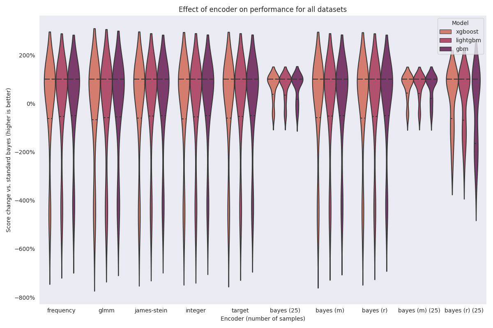
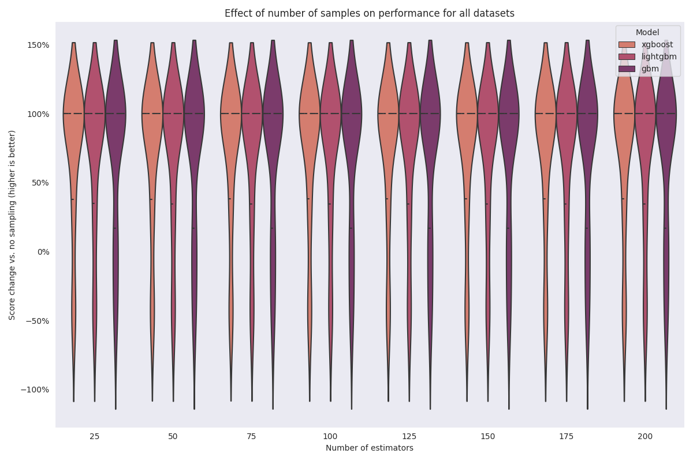

=================================
When should you use this package?
=================================

We have leveraged the experimental framework discussed by :footcite:t:`pargent`
to analyze bayesian target encoding (BTE) and answer the following questions:

- **Marginal BTE**: Is there lift from a staged approach:

  #. Fit a submodel [*]_ that uses all non-categorical columns to predict the target.
  #. Fit the encoder using the submodel output as the target.
  #. Use the encoding and the raw input non-categorical data to fit the final model.

.. [*]

    What if the encoder is fitted using the residuals from the submodel as the
    target?

Encoder comparison
------------------

  ``(m)`` indicates that the encoder used the "marginal" approach. ``(r)`` indicates
  that the encoder uses the "residual" approach.

In this experiment, we wanted to compare the standard bayesian target encoding to other
popular encoding methodologies. We also wanted to test a "staged approach", where we

#. fit a submodel that uses all non-categorical columns as features,
#. fit the encoder using either the submodel output (the "marginal" approach) or the residuals as the target, and
#. use the encoding and raw numeric features to fit the final model.

The idea here is that the categorical encoding can try to use the information not captured
by numeric variables and produce a more useful encoding.

The aggregated visualization doesn't show this well, but we have three takeaways from this
experiment:

#. Non-sampled bayesian target encoding does not outperform other encoding methods,
#. Sample bayesian target encoding performs the best, and
#. marginal/residual encoding provides very incremental benefit at best.

Ensemble methodology\ :footcite:p:`larionov`
--------------------------------------------

We wanted to answer the following questions:

- How much does repeated sampling help?
- How many samples do you need?

The short answer is that repeated sampling will *almost definitely help* with test
performance. Only two datasets, :doc:`churn <classification/churn>` and :doc:`flight-delay-usa-dec-2017 <regression/flight>`,
saw decreases in test performance.

Surprisingly, only 25 samples are required to see an increase in performance.

Comparative encoding methodology
--------------------------------

When conducting these experiments, we'll compare BTE to the following encoding
methodologies. Suppose you have :math:`n` training observations, with
:math:`Y = (y_{1}, ..., y_{n})` representing the target and categorical variable
:math:`X_{1} = (x_{1}, ..., x_{n})` with distinct values :math:`V = (v_{1}, ..., v_{l})`.

:footcite:t:`pargent` provide a description for each encoding methodology listed
below.

+--------------------------------+-------------+------------------------------------------+
| Encoding                       | Supervised? | Implementation                           |
|                                |             |                                          |
+================================+=============+==========================================+
| Frequency                      | N           | ``category_encoders.CountEncoder``       |
+--------------------------------+-------------+------------------------------------------+
| Generalized Linear Mixed Model | Y           | ``category_encoders.GLMMEncoder``        |
+--------------------------------+-------------+------------------------------------------+
| James-Stein                    | Y           | ``category_encoders.JamesSteinEncoder``  |
+--------------------------------+-------------+------------------------------------------+
| Integer                        | N           | ``sklearn.preprocessing.OrdinalEncoder`` |
+--------------------------------+-------------+------------------------------------------+
| Target                         | Y           | ``category_encoders.TargetEncoder``      |
+--------------------------------+-------------+------------------------------------------+

Modeling algorithms
-------------------

The following modelling implementations will be tested:

+------------------------------------------+---------------------------------+
| Package                                  | Class                           |
|                                          |                                 |
+==========================================+=================================+
| LightGBM\ :footcite:p:`lightgbm`         | ``LGBMClassifier``              |
+------------------------------------------+---------------------------------+
|                                          | ``LGBMRegressor``               |
+------------------------------------------+---------------------------------+
| Scikit-Learn\ :footcite:p:`scikit-learn` | ``GradientBoostingRegressor``   |
+------------------------------------------+---------------------------------+
|                                          | ``GradientBoostingClassifier``  |
+------------------------------------------+---------------------------------+
| XGBoost\ :footcite:p:`xgboost`           | ``XGBClassifier``               |
+------------------------------------------+---------------------------------+
|                                          | ``XGBRegressor``                |
+------------------------------------------+---------------------------------+

Datasets
--------

Regression
~~~~~~~~~~

Below is a list of the regression datasets used for
experimentation\ :footcite:p:`pargent`.

+-------------------------------------------+---------------------------------------------------------------+
| OpenML ID                                 | Dataset name                                                  |
|                                           |                                                               |
+===========================================+===============================================================+
| `41211 <https://www.openml.org/d/41211>`_ | :doc:`ames-housing <regression/housing>`                      |
+-------------------------------------------+---------------------------------------------------------------+
| `41445 <https://www.openml.org/d/41445>`_ | :doc:`employee_salaries <regression/salaries>`                |
+-------------------------------------------+---------------------------------------------------------------+
| `41210 <https://www.openml.org/d/41210>`_ | :doc:`avocado-sales <regression/avocado>`                     |
+-------------------------------------------+---------------------------------------------------------------+
| `41267 <https://www.openml.org/d/41267>`_ | :doc:`particulate-matter-ukair-2017 <regression/particulate>` |
+-------------------------------------------+---------------------------------------------------------------+
| `41251 <https://www.openml.org/d/41251>`_ | :doc:`flight-delay-usa-dec-2017 <regression/flight>`          |
+-------------------------------------------+---------------------------------------------------------------+

Classification
~~~~~~~~~~~~~~

+-------------------------------------------+---------------------------------------------------------------+
| OpenML ID                                 | Dataset name                                                  |
|                                           |                                                               |
+===========================================+===============================================================+
| `40701 <https://www.openml.org/d/40701>`_ | :doc:`churn <classification/churn>`                           |
+-------------------------------------------+---------------------------------------------------------------+
| `41434 <https://www.openml.org/d/41434>`_ | :doc:`click_prediction_small <classification/click>`          |
+-------------------------------------------+---------------------------------------------------------------+

Performance evaluation
----------------------

:footcite:t:`pargent` discussed a three-phase approach for creating a baseline
assessment of model performance. We'll adapt that here and use something slightly
different. **Baseline performance** will be the average test score for a model fitted
using the *standard* bayesian target encoder. We will repeat each experiment with 5
different random seeds for the train-test split.

Similar to :footcite:t:`pargent`, we will use root mean squared error (RMSE) for
evaluating the performance of regression models and the area under the receiver
operating characteristic (AUROC) for classification problems. Both metrics are
available in ``scikit-learn``\ :footcite:p:`scikit-learn` under the strings
``neg_root_mean_squared_error`` and ``roc_auc``, respectively.

Since we will *not* be doing any hyperparameter optimization, we will express the
change in performance using a percentage increase in the stated metric.

.. footbibliography::
