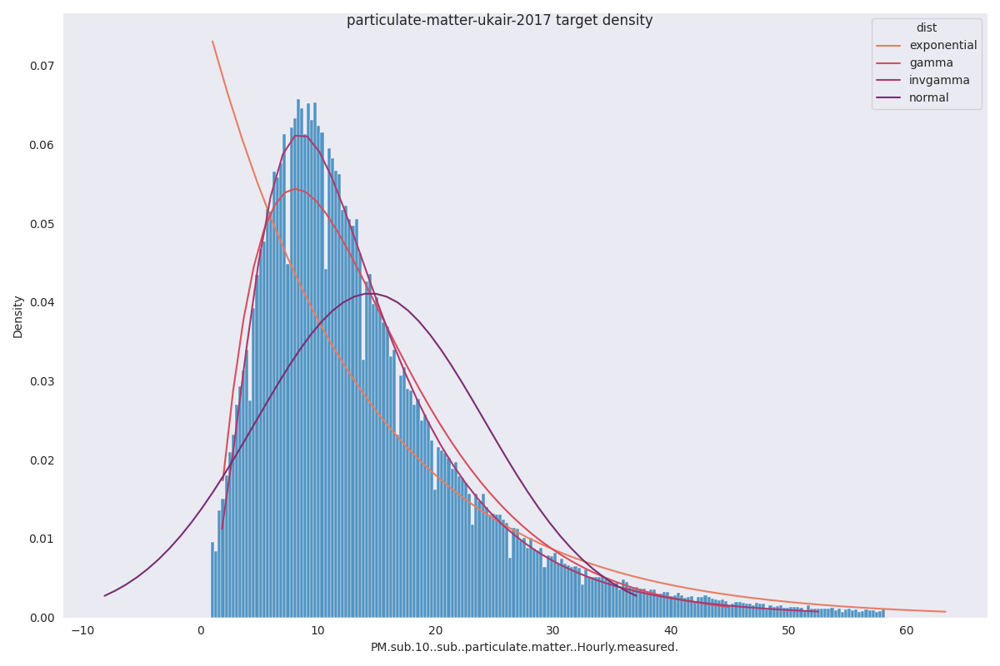
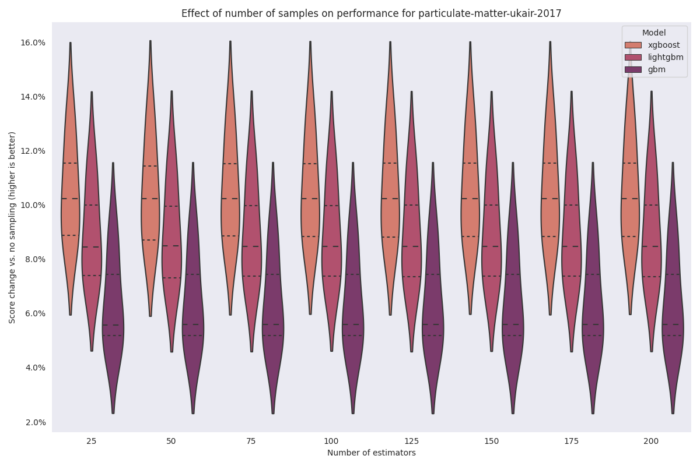

=============================
particulate-matter-ukair-2017
=============================

.. note::

    All observations below the 1st and above the 99th percentile were removed
    for visualization purposes.

For this dataset, we will use the ``invgamma`` likelihood.

Sampling experiment
-------------------

Encoder comparison
------------------

.. image:: ../../../experiments/outp9ut/particulate-matter-ukari-2017-comparison.png
    :align: center
