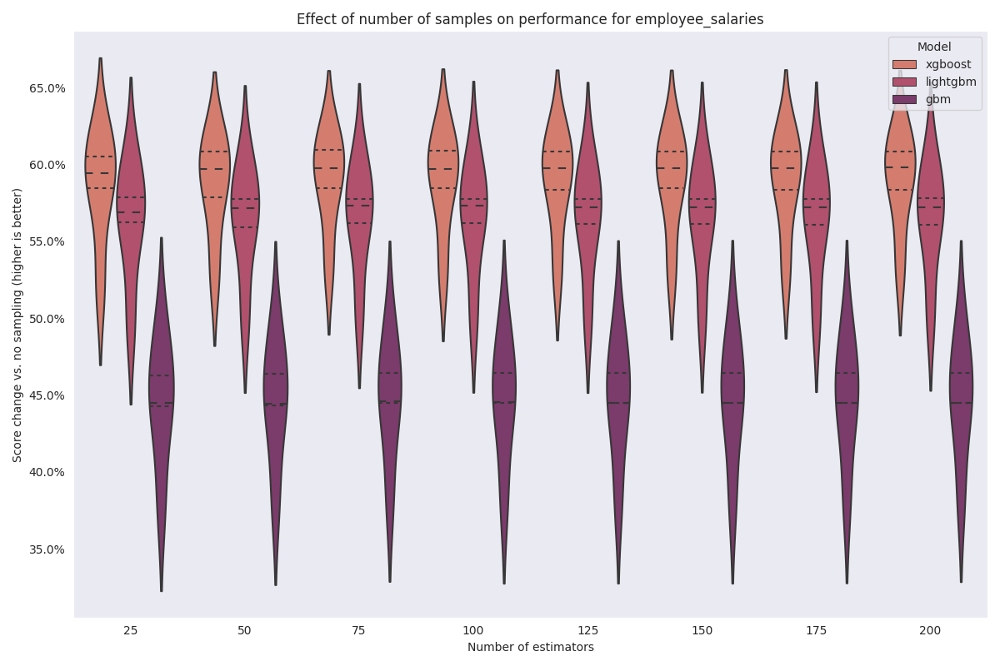

=================
employee_salaries
=================

.. note::

    All observations below the 1st and above the 99th percentile were removed
    for visualization purposes.

.. image:: ../../../experiments/output/employee_salaries.png
    :align: center

For this dataset, we will use the ``invgamma`` likelihood.

Sampling experiment
-------------------

Encoder comparison
------------------

